# Đánh giá nguồn dữ liệu ngoài cho RAG

> Ngày đánh giá: 2026-07-30
> Phạm vi: nguồn văn bản pháp luật Chính phủ có thể dùng cho MVP
> Trạng thái: đánh giá khả thi; chưa triển khai connector hoặc nhập production

## 1. Kết luận

Có thể lấy dữ liệu từ nguồn bên ngoài ứng dụng để nạp vào database và xây kho
RAG, nhưng hiện chưa có bằng chứng về một API công khai, có version và cam kết
ổn định từ các cổng đã kiểm tra. Phương án khả thi trước mắt là:

1. ưu tiên API/export chính thức nếu cơ quan vận hành cung cấp tài liệu tích hợp;
2. nếu chưa có API, dùng connector giới hạn cho trang HTML/PDF chính thức;
3. lưu dữ liệu vào staging/draft cùng provenance và checksum;
4. dùng AI để trích xuất, phân loại và gợi ý bản nháp;
5. chỉ đưa vào corpus sau khi qua quy trình bốn mắt;
6. người dùng cuối chỉ hỏi trên corpus đã duyệt, không live-search web.

API key của model không thay thế nguồn dữ liệu. Model chỉ được nhận câu hỏi đã
sanitize và evidence bundle đã truy xuất; nếu không có evidence hợp lệ, hệ thống
trả `unavailable`.

## 2. Kết quả kiểm tra nguồn chính thức

Mỗi nguồn dùng hai dimension độc lập:

- `trust_class`: `official`, `discovery_only` hoặc `rejected`;
- `readiness`: `green`, `yellow`, `red` hoặc `unverified`.

`official` chỉ mô tả chủ thể/nguồn gốc. Một nguồn official vẫn không được ingest
production nếu readiness chưa `green`.

### 2.1 Cơ sở dữ liệu quốc gia về văn bản pháp luật

- URL: <https://vbpl.moj.gov.vn/pages/portal.aspx> và <https://vbpl.vn>.
- Cơ quan/nguồn: Cơ sở dữ liệu quốc gia về văn bản pháp luật.
- Dữ liệu quan sát được: số/ký hiệu, trích yếu, cơ quan ban hành, ngày ban hành,
  ngày hiệu lực, tình trạng hiệu lực, toàn văn, văn bản liên quan, lịch sử hiệu
  lực và file gốc/PDF.
- Trang giới thiệu chính thức nêu hệ thống cho phép xem toàn văn, tra cứu lịch sử
  hiệu lực và tải văn bản về sử dụng:
  <https://vbpl.moj.gov.vn/Pages/gioi-thieu.aspx>.
- `trust_class`: **official**.
- `readiness`: **yellow — khả thi có điều kiện**.
- Lý do: có dữ liệu và file tải chính thức phù hợp để tạo candidate, nhưng tại
  ngày đánh giá chưa tìm thấy tài liệu API công khai, versioned, quota hoặc
  điều khoản bulk ingestion. Không được phụ thuộc vào endpoint nội bộ chưa công
  bố.

### 2.2 Hệ thống văn bản của Cổng Thông tin điện tử Chính phủ

- URL: <https://vanban.chinhphu.vn/>.
- Dữ liệu quan sát được: danh sách/tìm kiếm văn bản, số ký hiệu, ngày ban hành,
  ngày hiệu lực, loại văn bản, cơ quan ban hành, người ký, trích yếu và file PDF
  trên `datafiles.chinhphu.vn`.
- Ví dụ cấu trúc trang chi tiết:
  <https://vanban.chinhphu.vn/?classid=1&docid=218095&pageid=27160&typegroupid=3>.
- Cổng yêu cầu ghi rõ nguồn khi phát hành lại thông tin. `robots.txt` của
  `chinhphu.vn` cho phép user-agent truy cập, nhưng đây không thay thế điều khoản
  sử dụng, quyền bulk ingestion hoặc SLA API:
  <https://chinhphu.vn/robots.txt>.
- `trust_class`: **official**.
- `readiness`: **yellow — khả thi có điều kiện**.
- Lý do: HTML/PDF có cấu trúc đủ để làm connector thử nghiệm; chưa tìm thấy tài
  liệu API/feed công khai và ổn định tại ngày đánh giá.

### 2.3 Cổng dữ liệu quốc gia

- URL kiểm tra: <https://data.gov.vn/>.
- `trust_class`: **official** ở cấp domain; chưa xác minh dataset cụ thể.
- `readiness`: **unverified**.
- Lý do: cổng không trả nội dung ổn định trong lần kiểm tra và chưa tìm thấy bộ
  dữ liệu văn bản pháp luật/API cụ thể từ nguồn chính thức. Không đưa vào
  allowlist hoặc kế hoạch ingestion cho tới khi có dataset URL, license và mẫu
  payload xác minh được.

### 2.4 Nhà cung cấp/aggregator khác

Chưa có tên nhà cung cấp, tài liệu API hoặc mẫu dữ liệu cụ thể nên chưa thể kết
luận tích hợp. Phân loại mặc định:

- **A — official:** API/export do cơ quan Chính phủ vận hành, URL thuộc allowlist
  và điều khoản cho phép sử dụng → có thể vào staging và trở thành source sau
  review.
- **B — discovery-only:** aggregator có thể resolve về canonical URL Chính phủ
  → chỉ dùng phát hiện candidate; citation phải trỏ về nguồn Chính phủ.
- **C — reject:** không có provenance/canonical URL chính thức hoặc điều khoản
  không cho phép lưu/tái sử dụng → không vào corpus.

### 2.5 Evidence log và giới hạn kết luận

- Thời điểm kiểm tra: 2026-07-30, timezone Asia/Ho_Chi_Minh.
- Phương pháp: tìm kiếm web giới hạn trên các domain official; mở trang portal,
  trang giới thiệu/hướng dẫn, trang danh sách, một trang chi tiết văn bản,
  attachment link và `robots.txt` khả dụng.
- Query scope: tìm `API`, `web service`, `dịch vụ web`, `open data`, `RSS`,
  `export` và các biến thể liên quan tới văn bản quy phạm pháp luật trên
  `vbpl.vn`, `vbpl.moj.gov.vn`, `chinhphu.vn` và `data.gov.vn`.
- Positive evidence đã mở nằm trong các URL ở mục 2.1–2.3. Footer trang chi tiết
  của `vanban.chinhphu.vn` là evidence cho yêu cầu attribution quan sát được.
- Negative finding được hiểu là **“không tìm thấy trong phạm vi kiểm tra trên”**,
  không phải chứng minh API không tồn tại.
- Chưa đăng nhập, chưa liên hệ owner, chưa kiểm tra tài liệu tích hợp nội bộ và
  chưa có test credential. Do đó không có nguồn nào đạt readiness `green`.

## 3. Kiến trúc ingestion và RAG đề xuất

```mermaid
flowchart LR
    A["API/export chính thức<br/>hoặc HTML/PDF allowlist"] --> B["Connector giới hạn"]
    B --> C["Raw snapshot / quarantine"]
    C --> D["Parse + normalize + checksum"]
    D --> E["AI trích xuất/gợi ý<br/>draft only"]
    E --> F["Editor"]
    F --> G["Pending review"]
    G --> H["Reviewer khác editor"]
    H --> I["Published corpus trong D1"]
    I --> J["D1 FTS5 / structured retrieval"]
    J --> K["Evidence validator"]
    K --> L["AI composer có schema"]
    L --> M["Server gắn citation từ DB"]
    K --> N["Không đủ evidence: unavailable"]
```

RAG MVP không bắt buộc vector database. Cloudflare D1 hỗ trợ SQLite FTS5, nên có
thể bắt đầu bằng structured filter + alias + FTS5. Chỉ thêm Cloudflare Vectorize
hoặc vector store khác khi golden set chứng minh recall chưa đạt yêu cầu.

**PROP-001 — chờ owner duyệt:** giữ public/admin/query trong Worker hiện tại;
scheduled/batch ingestion chạy ở Worker riêng có source credential, R2 và
Queue/DLQ. Đây là đề xuất topology, chưa phải quyết định đã phê duyệt.

## 4. Data contract tối thiểu trước khi tích hợp một nguồn

Nguồn/provider phải cung cấp hoặc cho phép xác định:

- `provider`, `external_id` ổn định và canonical official URL;
- số/ký hiệu, tiêu đề, cơ quan ban hành, ngày ban hành, ngày hiệu lực/hết hiệu
  lực;
- toàn văn hoặc file HTML/PDF và ranh giới điều/khoản/điểm nếu có;
- `source_updated_at`, version/checksum/ETag và tín hiệu thay thế/bãi bỏ/xóa;
- pagination/cursor, quota, rate limit, timeout và cơ chế xác thực;
- license/terms, yêu cầu attribution và chu kỳ cập nhật.

Mỗi lần nhập phải giữ:

- `provider`, `external_id`, `canonical_url`;
- `fetched_at`, `raw_sha256`, `raw_version`, `raw_snapshot_ref`;
- `parser_version`, `ingestion_job_id`;
- trạng thái parse/validation/review và lý do reject/quarantine.

Idempotency key đề xuất:
`(provider, external_id, source_version_or_checksum)`.

## 5. Guardrail bắt buộc

- Chỉ fetch HTTPS host allowlist; chặn redirect ra ngoài allowlist, private IP,
  file quá kích thước và MIME không hỗ trợ.
- Từ chối URL có userinfo, port ngoài policy hoặc IP literal; resolve và pin
  public IP cho từng hop, re-check redirect để chống DNS rebinding.
- Giới hạn compressed/decompressed bytes, số trang, CPU/memory/time của parser;
  kiểm thử malware/polyglot/decompression-bomb PDF.
- Giới hạn timeout, concurrency, retry và tốc độ theo từng nguồn.
- Không coi text trong tài liệu là instruction cho model; tài liệu là dữ liệu
  không tin cậy có thể chứa prompt injection.
- AI không được xác nhận hiệu lực, tự tạo citation hoặc auto-publish.
- Citation và mức xử lý cuối cùng do server lấy từ record `published` còn hiệu
  lực.
- Source thay đổi/hết hiệu lực phải invalidate provision/index liên quan và đưa
  về review.
- Lưu lỗi vào quarantine/dead-letter flow; rerun không tạo record trùng.

## 6. Sử dụng OpenAI trong hai lane

### Backoffice ingestion/discovery

- Có thể dùng Responses API với `web_search` và `allowed_domains` chỉ gồm domain
  chính thức để tìm candidate.
- Yêu cầu trả đầy đủ danh sách nguồn bằng
  `include: ["web_search_call.action.sources"]`.
- Dùng Structured Outputs để trích xuất metadata theo JSON Schema.
- Kết quả luôn là draft và phải lưu URL/provenance trước khi review.
- Mọi URL model trả về phải được canonicalize, refetch và kiểm tra lại bằng
  exact authority allowlist của DEC-004; domain filter của provider không thay
  thế server-side validation.

Tài liệu chính thức:

- Domain filtering:
  <https://developers.openai.com/api/docs/guides/tools-web-search#domain-filtering>
- Danh sách sources:
  <https://developers.openai.com/api/docs/guides/tools-web-search#sources>
- Structured Outputs:
  <https://developers.openai.com/api/docs/guides/structured-outputs>

### Runtime hỏi đáp

- Retrieve từ corpus đã reviewed/published/effective.
- Chỉ gửi sanitized question + evidence bundle tới model.
- Model trả output có schema và chỉ tham chiếu evidence IDs đã cấp.
- Server validate ID rồi gắn citation/URL/mức xử lý từ D1.
- Missing key, timeout, malformed output hoặc citation ID lạ → curated response
  nếu đủ dữ liệu, nếu không → `unavailable`.

Không dùng `OPENAI_API_KEY` để hỏi model bằng kiến thức mở khi retrieval không
match.

## 7. Env/binding cần có

### Hiện tại

- `ADMIN_USERNAME`
- `ADMIN_PASSWORD_HASH`
- `ADMIN_SESSION_SECRET` tối thiểu 32 ký tự
- Cloudflare D1 binding `DB`

### Khi triển khai AI composer

- `OPENAI_API_KEY` — secret server-side, không dùng prefix `NEXT_PUBLIC_`
- `OPENAI_MODEL` — tên model cấu hình
- `AI_REPHRASE_ENABLED=false` — feature flag mặc định tắt
- `AI_WEB_SEARCH_ENABLED=false` — discovery backoffice mặc định tắt
- `AI_PROVIDER_TIMEOUT_MS`
- `AI_PROVIDER_MAX_REQUESTS_PER_MINUTE` hoặc quota tương đương

### Khi triển khai ingestion

- `INGESTION_ENABLED=false`
- `SOURCE_PROVIDER_BASE_URL` — phải khớp source registry đã duyệt, không mở rộng
  allowlist
- `SOURCE_PROVIDER_API_KEY` — secret nếu provider yêu cầu
- `SOURCE_FETCH_USER_AGENT`
- `INGESTION_TIMEOUT_MS`
- `INGESTION_MAX_DOC_BYTES`
- `CRON_SECRET` — chỉ khi dùng HTTP-trigger nội bộ thay vì platform schedule
- binding R2 `RAW_DOCUMENTS` bắt buộc cho immutable raw snapshots
- binding Queue + dead-letter queue bắt buộc khi chạy batch/retry production

Domain allowlist là policy versioned trong code/database, không nên là env có thể
mở rộng tùy ý lúc runtime.

## 8. Điều kiện go/no-go cho nguồn cụ thể

Chỉ quyết định **go** sau khi có:

1. tên provider và owner;
2. API docs/base URL hoặc export URL chính thức;
3. sample JSON/XML/HTML/PDF;
4. auth/test credential nếu cần;
5. license/terms/attribution;
6. quota, update cadence và cơ chế supersede/delete;
7. spike mapping thành công vào `legal_sources`/`legal_provisions`;
8. reviewer xác nhận provenance và cách xử lý hiệu lực.

Thiếu các đầu vào trên không ngăn việc thiết kế pipeline, nhưng ngăn việc tuyên
bố một provider cụ thể đã sẵn sàng để ingest production.
